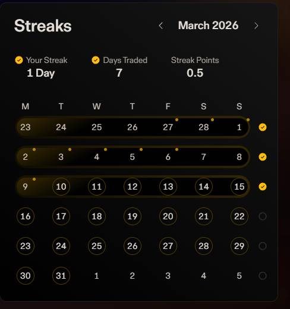

Đây sẽ là nơi lưu nội dung hướng dẫn tham gia airdrop dự án Decibel

Một điều khá quan trọng là bạn nên giao dịch theo chuỗi liên tục

- Để tham gia dự án, bạn vẫn có thể sử dụng ví EVM (Metamask,Rabby....) là được
- Nếu được, hãy ủng hộ mình bằng cách sử dụng 1 trong 5 mã ref sau:

1️⃣ https://app.decibel.trade/r/2A391W  

2️⃣ https://app.decibel.trade/r/BQS1QR  

3️⃣ https://app.decibel.trade/r/BXKPNN  

4️⃣ https://app.decibel.trade/r/WNF03A  

5️⃣ https://app.decibel.trade/r/XT8D8V  

- Bạn cần chuẩn bị $USDT hoặc $USDC trên mạng Arbitrum  
- Deposit từ ví EVM vào tài khoản   
- Tiến hành trade volume >1k mỗi ngày & giữ lệnh ~ 5-10 phút để điểm danh.  
- Việc trade & đặc biệt là long/short luôn có rủi ro nên anh em DYOR nhé.